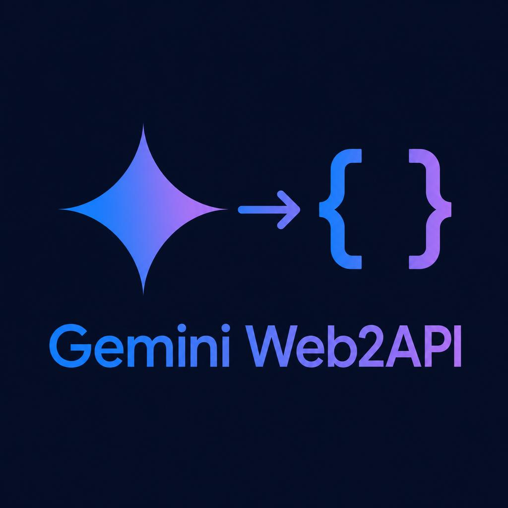

# ChatGemini

<p align="center">
  
</p>

<p align="center">
  <strong>A stable, chat-only Gemini Web gateway for OpenAI and NewAPI.</strong><br>
  Built for NewAPI, OpenWebUI, and ordinary chatbot clients.
</p>

<p align="center">
  <a href="https://github.com/ksda9001/ChatGemini/stargazers"></a>
  <a href="https://github.com/ksda9001/ChatGemini/network/members"></a>
  <a href="LICENSE"></a>
  
  
</p>

<p align="center"><a href="README_CN.md">中文文档</a></p>

> ChatGemini is an unofficial compatibility layer for Gemini's web service, not an official Google API. Upstream behavior, account access, and rate limits remain controlled by Google.

## Why ChatGemini?

ChatGemini deliberately does one job: **reliable chatbot responses**. Its primary interface is OpenAI Chat Completions, with a small Gemini-native text adapter for Gemini channels.

The project removes coding-agent protocols, tool-call prompts, function-call parsing, Anthropic Messages, OpenAI Responses, and Google-native function calling. A smaller protocol surface means fewer prompt collisions, shorter requests, and fewer ways for NewAPI or OpenWebUI traffic to be misclassified.

- OpenAI-compatible `/v1/chat/completions`
- Gemini-native text compatibility for NewAPI `/v1beta` channels
- Standard and streaming responses
- NewAPI and OpenWebUI friendly SSE behavior
- Heartbeats while Gemini is still thinking
- Automatic retries for empty upstream responses
- Automatic continuation for Gemini output-limit error `1155`
- Optional authenticated Gemini Web sessions
- Plain-chat conversation reuse backed by one small SQLite table
- OpenWebUI title, tag, and follow-up requests sent as temporary chats
- Optional image input through OpenAI multimodal message content
- Docker, Podman, and native Python deployment

## Intentionally not supported

ChatGemini does **not** provide:

- tool or function calling
- Codex Responses API
- Claude/Anthropic Messages API
- coding-agent execution loops
- Google-native tool or function calling

If a client sends OpenAI `tools`, `functions`, or `tool_choice`, or Gemini-native `tools`, `toolConfig`, `functionCall`, or `functionResponse`, ChatGemini ignores them and returns plain assistant text. Tool schemas and results are never injected into the Gemini prompt.

## API surface

| Method | Route | Purpose |
| --- | --- | --- |
| `GET` | `/` | Service status |
| `GET` | `/healthz` | Health check |
| `GET` | `/v1/models` | OpenAI-compatible model list |
| `POST` | `/v1/chat/completions` | Chat, including SSE streaming |
| `GET` | `/v1beta/models` | Gemini-compatible model list for NewAPI |
| `POST` | `/v1beta/models/{model}:generateContent` | Gemini-compatible text chat |
| `POST` | `/v1beta/models/{model}:streamGenerateContent` | Gemini-compatible text SSE |

The `/v1beta` adapter is deliberately text-only. It exists to keep Gemini-format NewAPI channels working, not to restore Google function calling or agent behavior.

## Quick start

### Docker

```bash
git clone https://github.com/ksda9001/ChatGemini.git
cd ChatGemini

cp config.example.json config.json
docker build -t chatgemini .

docker run -d \
  --name chatgemini \
  --restart unless-stopped \
  -p 8081:8081 \
  -v "$PWD/config.json:/app/config.json:ro" \
  -v chatgemini-data:/app/data \
  chatgemini
```

Podman uses the same build and run arguments.

### Docker Compose

```bash
cp config.example.json config.json
docker compose up -d --build
```

### Python

```bash
git clone https://github.com/ksda9001/ChatGemini.git
cd ChatGemini

python -m venv .venv
source .venv/bin/activate
python -m pip install -r requirements.txt
cp config.example.json config.json
python -m chatgemini --config config.json
```

The service starts at `http://127.0.0.1:8081`.

## First chat request

```bash
curl http://127.0.0.1:8081/v1/chat/completions \
  -H 'Content-Type: application/json' \
  -d '{
    "model": "gemini-3.5-flash",
    "messages": [{"role": "user", "content": "Hello!"}]
  }'
```

Streaming:

```bash
curl -N http://127.0.0.1:8081/v1/chat/completions \
  -H 'Content-Type: application/json' \
  -d '{
    "model": "gemini-3.5-flash",
    "messages": [{"role": "user", "content": "Write a short story."}],
    "stream": true,
    "stream_options": {"include_usage": true}
  }'
```

## Connect NewAPI

The preferred NewAPI configuration is an OpenAI-compatible channel:

| Field | Value |
| --- | --- |
| Channel type | OpenAI |
| Base URL | `http://YOUR_SERVER:8081` |
| API key | Any placeholder when `api_keys` is empty; otherwise a configured key |
| Model | `gemini-3.5-flash` |

If your NewAPI version expects the versioned base URL, use `http://YOUR_SERVER:8081/v1`.

Existing Gemini-format NewAPI channels can stay in place. Point their Base URL at `http://YOUR_SERVER:8081`; ChatGemini supports the native `generateContent` and `streamGenerateContent` routes for text chat. This compatibility mode ignores Gemini tool/function settings. Anthropic channels remain unsupported.

Recommended NewAPI settings:

- enable streaming
- keep the channel response timeout above your reverse proxy timeout
- do not enable function calling for this channel
- use model mapping only when the client insists on a different model name

Unknown model identifiers automatically fall back to `default_model`, which makes model mapping more forgiving.

## Connect OpenWebUI

Add an OpenAI-compatible connection:

```text
URL:     http://YOUR_SERVER:8081/v1
API key: any placeholder when api_keys is empty
```

OpenWebUI can then fetch `/v1/models` and use normal or streaming chat. Its default title, tag, follow-up, and image-prompt helper requests are detected and sent to Gemini as temporary chats so they do not clutter the signed-in account's visible history.

For the most predictable behavior, disable OpenWebUI tools/functions for ChatGemini models. Accidental tool definitions are ignored, but there is no reason to send them.

## OpenAI Python SDK

```python
from openai import OpenAI

client = OpenAI(
    base_url="http://127.0.0.1:8081/v1",
    api_key="placeholder",
)

response = client.chat.completions.create(
    model="gemini-3.5-flash",
    messages=[{"role": "user", "content": "Explain relativity simply."}],
)

print(response.choices[0].message.content)
```

## Models

| Model | Description |
| --- | --- |
| `gemini-3.5-flash` | Fast general-purpose chat |
| `gemini-3.5-flash-thinking` | Deeper reasoning and longer output |
| `gemini-3.5-flash-thinking-lite` | Adaptive thinking mode |
| `gemini-3.1-pro` | Pro preference; real routing requires an eligible account |
| `gemini-3.1-pro-enhanced` | Experimental enhanced Pro mode |
| `gemini-auto` | Upstream automatic selection |
| `gemini-flash-lite` | Lightweight fast mode |

Thinking depth can be selected with a model suffix:

```text
gemini-3.5-flash-thinking@think=0
gemini-3.5-flash-thinking@think=2
gemini-3.5-flash-thinking@think=4
```

## Anonymous and authenticated modes

ChatGemini can use Gemini Web anonymously. This is the easiest mode and is the default example configuration. OpenWebUI and NewAPI already send the complete message history on every request, so ordinary multi-turn chat still works.

An authenticated browser session adds:

- account-eligible model routing
- Gemini Web conversation metadata
- optional upstream conversation reuse
- background cookie refresh

Supported cookie files include plain `name=value` strings, compact JSON, Chrome cookie arrays, and Playwright exports. Keep at least `__Secure-1PSID` and `__Secure-1PSIDTS` from the same browser session.

Cookie files are credentials. Never commit them, publish them in an issue, or bake them into a container image.

Example authenticated Docker configuration:

```json
{
  "api_keys": ["change-this-private-key"],
  "cookie_file": "/app/cookie.json",
  "conversation_store_path": "/app/data/conversations.db",
  "reuse_upstream_sessions": true,
  "upstream_session_backend": "gemini_webapi"
}
```

Mount the cookie read-only:

```bash
docker run -d \
  --name chatgemini \
  --restart unless-stopped \
  -p 8081:8081 \
  -v "$PWD/config.json:/app/config.json:ro" \
  -v "$PWD/cookie.json:/app/cookie.json:ro" \
  -v chatgemini-data:/app/data \
  chatgemini
```

If Gemini is opened under an account path such as `/u/1/`, set `auth_user` to `"1"`. Some sessions may also need the page value named `SNlM0e` in `xsrf_token`.

## Plain-chat session reuse

With `reuse_upstream_sessions: true`, ChatGemini saves Gemini Web metadata for completed chat turns. On the next OpenAI request, it finds the exact previous message-history prefix and sends only the new user message to the same Gemini Web conversation. `gemini_webapi` is the default session backend; if it fails before producing text, ChatGemini automatically falls back to the direct Gemini Web transport and rebuilds the full chat context so the reply is not lost.

The SQLite database contains only ordinary conversation mappings:

```text
conversation_sessions
```

There are no response objects, tool calls, call IDs, or agent-state tables. If SQLite is unavailable, ChatGemini logs the cache failure and continues by sending the compacted full chat history.

## Stability choices

- OpenAI SSE role, content, stop, optional usage, and `[DONE]` frames
- `X-Accel-Buffering: no` for Nginx
- SSE comment heartbeats while waiting for Gemini
- bounded request body and bounded chat history
- deterministic removal of old messages
- empty-response retries
- automatic output continuation for `BardErrorInfo 1155`
- direct-transport fallback when an authenticated Web session fails before output
- browser-style Cookie expiration handling
- OpenWebUI background requests kept out of visible account history

## Important configuration

Start with [`config.example.json`](config.example.json).

| Setting | Purpose | Default behavior |
| --- | --- | --- |
| `api_keys` | Protect `/v1/*` | Empty disables authentication |
| `cookie_file` | Browser session file | `null` uses anonymous mode |
| `proxy` | HTTP proxy for Google | `null` uses direct/system networking |
| `conversation_store_path` | Plain-chat SQLite file | `/app/data/conversations.db` in Docker |
| `reuse_upstream_sessions` | Reuse Gemini Web metadata | Disabled until explicitly enabled |
| `upstream_session_backend` | Preferred upstream session backend | `gemini_webapi`; direct transport is the fallback |
| `max_history_messages` | Maximum recent chat messages | `60` |
| `max_history_chars` | Approximate prompt character cap | `80000` |
| `sse_heartbeat_sec` | Keepalive interval | `10` seconds |
| `continuation_attempts` | Output-limit continuation count | `2` |

Set a private API key before exposing the service outside localhost or a trusted network.

## Troubleshooting

### NewAPI or OpenWebUI reports a timeout

Check that every reverse proxy in the path allows streaming and has buffering disabled. ChatGemini sends heartbeats every `sse_heartbeat_sec`, but proxy read timeouts still need to be longer than that interval.

### Replies are empty or truncated

1. Check `curl http://127.0.0.1:8081/healthz`.
2. Inspect container logs.
3. Confirm the host can reach `https://gemini.google.com`.
4. Configure `proxy` when direct access is unavailable.
5. Refresh expired cookies or temporarily disable `reuse_upstream_sessions`.

### Tools do not work

That is intentional. ChatGemini is a chat-only service. Use it as an OpenAI chat channel and disable tools/functions for the model in your frontend.

### Authenticated conversations do not resume

Enable `reuse_upstream_sessions`, persist `/app/data`, and make sure the cookie account reports an available authenticated status. Chat continues with full-history fallback even when metadata reuse fails.

## Security and limitations

- Gemini Web is an unofficial upstream and may change without notice.
- Browser cookies are sensitive credentials and can be revoked by Google.
- Real Pro access depends on account eligibility, not merely having a cookie.
- Rate limits and risk controls still apply.
- Image upload depends on the authenticated Gemini Web upload path and may be less reliable than text.
- ChatGemini is not a substitute for an official Google API when contractual stability is required.

## Development

```bash
python -m unittest discover -s tests -q
python -m py_compile chatgemini/*.py tests/test_chatgemini.py
git diff --check
```

The test suite covers OpenAI and Gemini-compatible text response shapes, streaming, usage frames, heartbeats, route removal, ignored tool schemas, SQLite continuity, Cookie expiry, and output continuation.

## Acknowledgments

- [HanaokaYuzu/Gemini-API](https://github.com/HanaokaYuzu/Gemini-API) for the dynamic Gemini Web session client
- The open-source Gemini Web compatibility community

## License

[MIT](LICENSE)

If ChatGemini makes your NewAPI or OpenWebUI setup simpler, a star helps other chatbot builders find it.
